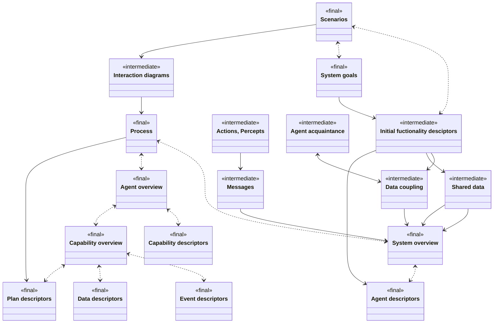

### When to design Agent Systems

Consider the following questions to consider if an agent system is the correct choice for solving a given problem
- Does it act autonomous?
- Does it have goals?
- Is it active?
- Does it do multiple things?
- Does it needs to change its behaviour based on environment changes?

### Design phases

1. **System specification**
	- Identify **goals** and **functionalities**
	- Develop **use case scenarios** for the system operation
	- Specify the interface in terms of Inputs (**percepts**) and outputs (**actions**)
1. **Architecture design**
	- Determine the agent types and how they interact
	- Capture the overall system structure in an **system overview diagram**
	- Describe the dynamic behaviour using **interaction diagrams** and **interaction protocols**
1. **Detailed design**
	- Look at the internals of each agent and how it will accomplish its tasks
	- Refine each agent by defining **capabilities**, **events**, **plans**, and **data structures**

### Design artifacts

Usually done in the form of UML diagrams.

Design artifacts contain
	- Goals of the system
	- The types of agents required
	- Messages, Percepts, Events, and Actions (as components, rather than labels)
	- Passive components 
		- Data
		- Beliefs
	- Active Components
		- Agents
		- Capabilities
		- Plans

