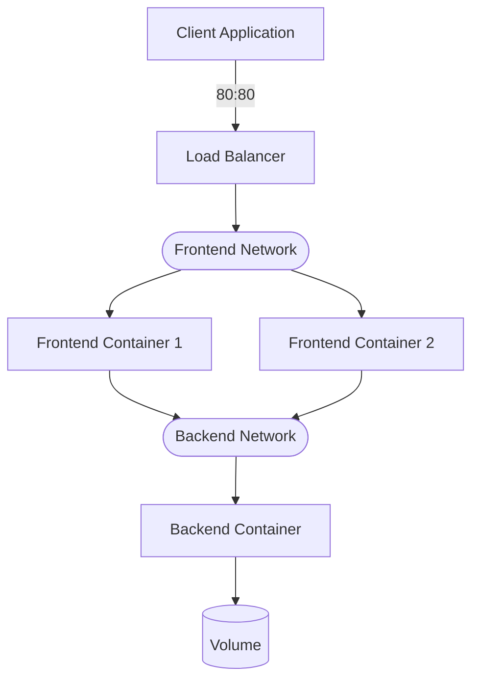

# docker network
Configures Software-Defined-Networks (SDNs)

- Host system requires port mapping to communicate with the frontend services
- Frontend services communicate to backend using network and don't require port mapping

## Examples

Create a network
```powershell
docker network create 'networkname'
```

Add a container to a network on start
```powershell
docker create --network 'networkname' #...
docker run --network 'networkname' #...
```

Add a container to a network
```powershell
docker network connect 'networkname' 'containername'
```

List containers on a network
```powershell
docker network inspect 'networkname'
```

Lists all networks
```powershell
docker network ls
```

Remove the network
```powershell
docker network rm
```

## Basic Architecture


## Configure Load Balancing

- Create multiple containers for frontend; do not use port mapping
- Create frontend network
- Connect containers for frontend to frontend network
- Create a load balancer container; ie.
   - [HAProxy](https://hub.docker.com/_/haproxy/) (Linux) 
   - [ngix](https://docs.nginx.com/) (Linux or Windows)
- Connect the load balancer to the frontend network and expose port to host system
- Configure the load-balancer container; crate and publish the new image when working

## See also
- [Docker Network reference](https://docs.docker.com/engine/reference/network/)