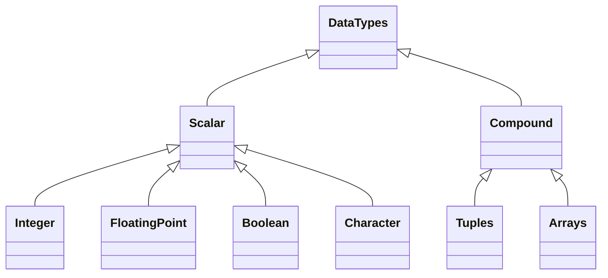

## Scalar Types

### Integer

| Bytes    | Signed  | Unsigned |
| -------- | ------- | -------- |
| 8        | `i8`    | `u8`     |
| 16       | `i16`   | `u16`    |
| 32       | `i32`   | `u32`    |
| 64       | `i64`   | `u64`    |
| 128      | `i128`  | `u128`   |
| 32 or 64 | `isize` | `usize`  |

```rust
let x = 5; # i32
let x:u32 = 5;
```

### Floating point

| Bytes | Type  |
| ----- | ----- |
| 32    | `f32` |
| 64    | `f64` |

```rust
let x = 5.0; # f64
let x:f32 = 5.0;
```

### Boolean
```rust
let x = true;
let x:bool = false;
```

### Character

4-byte Unicode character
```rust
let x = 'x';
let x = '\u{263A}'; # escape sequence
```

## Compound Types

### Tuples
```rust
let x: (u8, char, f32) = (10, 'a', 3.1415);

# deconstruction
let ten = x.0;
let a = x.1;
let pi = x.3;
```

### Arrays
```rust
let x: [i32; 3] = [10, 20, 30];
let ten = x[0];
```

#### Common Array Methods

| Method         | Description               |
| -------------- | ------------------------- |
| `array.len()`  | Length of array           |
| `array.iter()` | Get iterator for for-loop |
| `array[idx]`   | Get/set element at index  |
