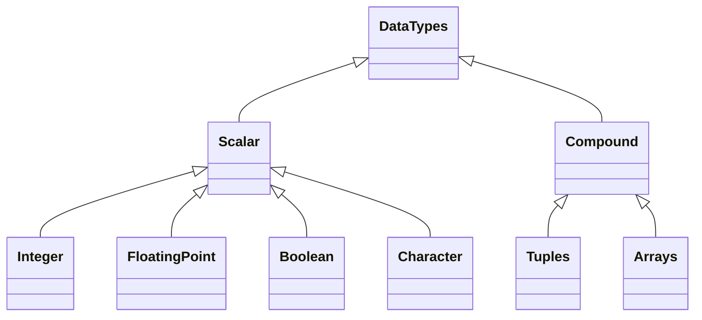

## Scalar Types

### Integer

| Bytes    | Signed  | Unsigned |
| -------- | ------- | -------- |
| 8        | `i8`    | `u8`     |
| 16       | `i16`   | `u16`    |
| 32       | `i32`   | `u32`    |
| 64       | `i64`   | `u64`    |
| 128      | `i128`  | `u128`   |
| 32 or 64 | `isize` | `usize`  |

```rust
let x = 5; # i32
let x:u32 = 5;
```

### Floating point

| Bytes | Type  |
| ----- | ----- |
| 32    | `f32` |
| 64    | `f64` |

```rust
let x = 5.0; # f64
let x:f32 = 5.0;
```

### Boolean
```rust
let x = true;
let x:bool = false;
```

### Character

4-byte Unicode character
```rust
let x = 'x';
let x = '\u{263A}'; # escape sequence
```

## Compound Types

### Tuples
```rust
let x: (u8, char, f32) = (10, 'a', 3.1415);

# deconstruction
let ten = x.0;
let a = x.1;
let pi = x.3;
```

### Arrays
```rust
let x: [i32; 3] = [10, 20, 30];
let ten = x[0];
```

#### Common Array Methods

| Method         | Description               |
| -------------- | ------------------------- |
| `array.len()`  | Length of array           |
| `array.iter()` | Get iterator for for-loop |
| `array[idx]`   | Get/set element at index  |

### String

String uses UTF-8 encoding and is created from String Literal.

String literal
```rust
let x = "some string"; // create string literal
```

Construct string type
```rust
let s = String::new();
let s = String::from("foobar");
let s = "foobar".to_string();
```

Use string type
```rust
let mut x = String:from("some string"); // convert immutable string literal to mutable string type
x.push_str(" foo"); // append to string

x.as_ptr(); // get pointer to memory location
x.len(); // legth of string
x.capacity(); // size of memory in bytes
let s = x.clone(); // copy string and create a new string on the heap
let a = x; // transfer ownership to a new variable/pointer
```

String concatenation
```rust 
let foo = String::from("foo");
let bar = String::from("bar");

let foobar = foo.add(&bar);
let foobar = foo + &bar; // uses add extension method
let foobar = foo + "bar"; // overload for string-literal
let foobar = format!("{}{}", foo, bar);
```

Get byte representation / char array
```rust
let foo = String::from("foo");
let bytes = foo.bytes(); // [102, 111, 111]
let chars = foo.chars(); // ['f', 'o', 'o']
```

### Slice

Slice of collection, like [#String], [#Array] or [#Vector]. Does not have ownership of data.

Internally implemented as pointer-address, data-type and length.

```rust
fn main() {
    let foobar = String.from("foobar");
    let foo = &foobar[0..2];
    let bar = &foobar[3..foobar.len())];
    println!("{} {}", foo, bar);
}
```

```rust
fn main() {
    let foobar = String.from("foobar");
    let foo = &foobar[..2];
    let bar = &foobar[3..)];
    println!("{} {}", foo, bar);
}
```

**Warning** Since strings are UTF-8 encoded, a single character can span between 1 and 4 bytes.

### Vector

`Vector` or `Vec<T>`.

```rust
let mut v: Vec<u8> = Vec::new();
let v = vec![1.5, 2.4, 3.3]; // Vec<f64>
```

Use `.push()` and `.pop()` to add/remove values to a mutable vector.

Use `{:?}` when formating a vector
```rust
let v = vec![1.5, 2.4, 3.3];
let str = format!("{:?}", v);
```

Get element
```rust
let v = vec![1.5, 2.4, 3.3];
let firstElement = v[0];
let firstElement = v.get(0);
```

Set element
```rust
let mut v = vec![1.5, 2.4, 3.3];
v[0] = 45.5;
v.set(0, 45.5);
```

## Hash map (Dictionary)
```rust
use std::collection::HashMap;

fn main()
{
    let mut currencies = HashMap::new();
    currencies.Insert("USD", "$");
    currencies.Insert("EUR", "€");
    let eur = currencies.get("EUR");
    let usd = currencies["USD"];

    println!("{:?}", currencies);

    for (key, value) in &currencies {
        println!("{}: {}", key, value);
    }

    currencies.remove("EUR");
    currencies.remove("USD");
}
```

## See also

- [[Rust Structs]]
- [[Rust Enums]]