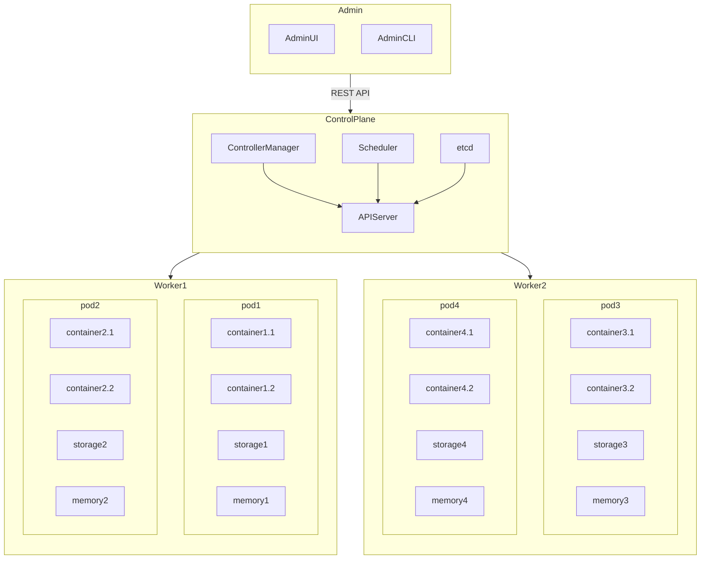

```mermaid
flowchart TB
    Admin -->|REST API| ControlPlane
    ControlPlane --> Worker1
    ControlPlane --> Worker2

    subgraph Worker1
      direction TB
      subgraph pod1
        direction LR
        container1.1
        container1.2
        storage1
        memory1
      end

      subgraph pod2
        direction LR
        container2.1
        container2.2
        storage2
        memory2
      end
    end

    subgraph Worker2
      direction TB
      subgraph pod3
        direction LR
        container3.1
        container3.2
        storage3
        memory3
      end

      subgraph pod4
        direction LR
        container4.1
        container4.2
        storage4
        memory4
      end
    end

    subgraph ControlPlane
      direction TB
      ControllerManager --> APIServer
      Scheduler --> APIServer
      etcd --> APIServer
      APIServer
    end

	subgraph Admin
	  direction TB
      AdminUI
      AdminCLI
    end
```