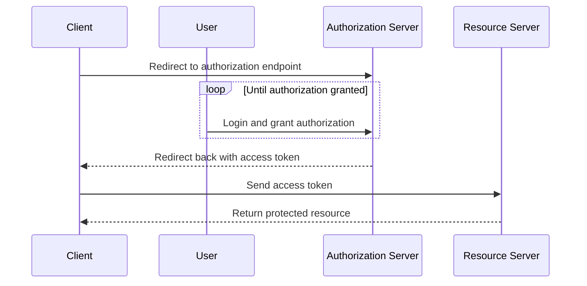

## Implicit Flow

1.  The client redirects the user to the authorization server to obtain authorization.
2.  The user logs in and grants authorization to the client.
3.  The authorization server redirects the user back to the client with an access token.



### Process

1. Set up your authorization server to support the implicit flow. This will typically involve defining an authorization endpoint and a token endpoint, as well as configuring your authorization server to support the response types and grant types required by the implicit flow.
2. In your Blazor client-side application, redirect the user to the authorization server's authorization endpoint. The authorization endpoint URL will typically include query parameters such as the client ID, the redirect URI, the response type, and the scope.
3. The user logs in and grants authorization to the client. This step may be repeated if the user does not grant authorization on the first attempt.
4. The authorization server redirects the user back to the client with an access token. The access token will typically be included in the fragment portion of the redirect URI.
5. In your Blazor client-side application, handle the redirect from the authorization server and extract the access token from the fragment portion of the redirect URI.
6. Use the access token to make API requests to the resource server on behalf of the user.

### Blazor Example

```csharp
public class MyComponent : ComponentBase
{
    [Inject]
    NavigationManager NavigationManager { get; set; } = null!;

    [Inject]
    HttpClient HttpClient { get; set; } = null!;

    // Declare a string to hold the access token
    private string accessToken = string.Empty;

    protected override void OnInitialized()
    {
        // Check if there is an access token in the fragment portion of the current URI
        string fragment = NavigationManager.ToAbsoluteUri(NavigationManager.Uri).Fragment;
        if (fragment.Contains("access_token"))
        {
            // Extract the access token from the fragment
            accessToken = fragment.Split('=')[1];
        }
        else
        {
            // Redirect to the authorization server's authorization endpoint
            string url = "https://auth.example.com/authorize?" +
                "client_id=my-client-id" +
                "&redirect_uri=https://myapp.example.com/callback" +
                "&response_type=token" +
                "&scope=openid profile email";
            NavigationManager.NavigateTo(url);
        }
    }

    // Use the access token to make API requests to the resource server
    public async Task<string> GetUserInfo()
    {
        // Set up an HTTP client with the access token
        HttpClient.DefaultRequestHeaders.Authorization = new AuthenticationHeaderValue("Bearer", accessToken);

        // Make an API request to the resource server
        HttpResponseMessage response = await HttpClient.GetAsync("https://api.example.com/userinfo");
        if (response.IsSuccessStatusCode)
        {
            return await response.Content.ReadAsStringAsync();
        }
        else
        {
            return "Error: " + response.StatusCode;
        }
    }
}
```