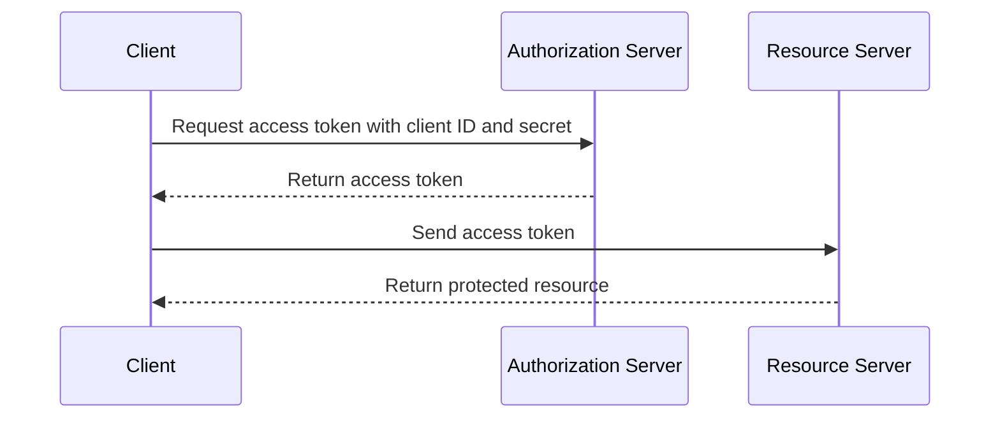

## Resource Owner Password Credentials Flow

1.  The client sends the resource owner's username and password to the authorization server.
2.  The authorization server authenticates the resource owner and returns an access token to the client.

