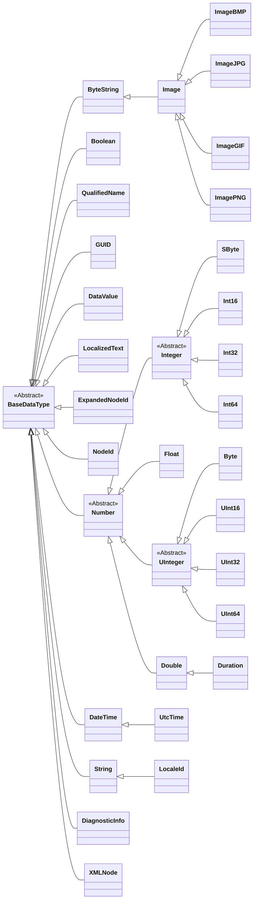

## Data Type Attributes

| Attribute     | DataType      | Required | Description                                                                                                                      |
| ------------- | ------------- | -------- | -------------------------------------------------------------------------------------------------------------------------------- |
| Nodeld        | Nodeld        | Required | *Inherited Node Attribute*                                                                                                       |
| NodeClass     | NodeClass     | Required | *Inherited Node Attribute*                                                                                                       |
| BrowseName    | QualifiedName | Required | *Inherited Node Attribute*                                                                                                       |
| DisplayName   | LocalizedText | Required | *Inherited Node Attribute*                                                                                                       |
| Description   | LocalizedText | Optional | *Inherited Node Attribute*                                                                                                       |
| WriteMask     | Ulnt32        | Optional | *Inherited Node Attribute*                                                                                                       |
| UserWriteMask | Ulnt32        | Optional | *Inherited Node Attribute*                                                                                                       |
| &mdash;       | &mdash;       | &mdash;  | &mdash;                                                                                                                          |
| IsAbstract    | Boolean       | Required | This Attribute indicates whether the ObjectType is concrete or abstract and therefore cannot directly be used as type definition |

## Built-In data types

| Built-in Type   | C# Type           | Example                                                    | Details                                                 | NodeId Type     |
| --------------- | ----------------- | ---------------------------------------------------------- | ------------------------------------------------------- | --------------- |
| Boolean         | `bool`            |                                                            | 0 (false) or 1 (true)                                   | 0 (numeric)     |
| SByte           | `sbyte`           |                                                            | -128 to 127                                             |                 |
| Byte            | `byte`            |                                                            | 0 to 255                                                |                 |
| Int16           | `short`           |                                                            | -32,768 to 32,767                                       |                 |
| UInt16          | `ushort`          |                                                            | 0 to 65,535                                             |                 |
| Int32           | `int`             |                                                            | -2,147,483,648 to 2,147,483,647                         |                 |
| UInt32          | `uint`            |                                                            | 0 to 4,294,967,295                                      |                 |
| Int64           | `long`            |                                                            | -9,223,372,036,854,775,808 to 9,223,372,036,854,775,807 |                 |
| UInt64          | `ulong`           |                                                            | 0 to 18,446,744,073,709,551,615                         |                 |
| Float           | `float`           |                                                            | IEEE single precision (32-bit) floating point value     |                 |
| Double          | `double`          |                                                            | IEEE double precision (64-bit) floating point value     |                 |
| StatusCode      | `uint`            |                                                            |                                                         |                 |
| String          | `string`          |                                                            |                                                         | 3 (string)      |
| DateTime        | `DateTime`        |                                                            | Number of 100-nanosecond intervals since 1/1/1601 (UTC) |                 |
| GUID            | `Guid`            |                                                            | 16-byte number used as a UUID                           | 4 (GUID)        |
| ByteString      | `byte[]`          |                                                            |                                                         | 5 (byte string) |
| XmlElement      | `XmlElement`      |                                                            |                                                         |                 |
| NodeId          | `NodeId`          | `{1, "TemperatureSensor1"}`                                | Namespace index and identifier                          |                 |
| ExpandedNodeId  | `ExpandedNodeId`  |                                                            | Similar to NodeId, includes namespace URI               |                 |
| QualifiedName   | `QualifiedName`   | `{1, "Temperature"}`                                       | Namespace index and string                              |                 |
| LocalizedText   | `LocalizedText`   | `{"en-US", "Temperature"}`                                 | String and a locale indicator                           |                 |
| NumericRange    | `string`          |                                                            | String (e.g., "0:4,1:5" for \[0..4\]\[1..5\] array)     |                 |
| Variant         | `object`          | `{Double, 23.5}`                                           | Can hold any built-in data type                         |                 |
| ExtensionObject | `ExtensionObject` |                                                            | Encapsulates complex data types                         |                 |
| DataValue       | `DataValue`       | `{23.5, Good, 2023-05-16T12:34:56Z, 2023-05-16T12:34:57Z}` | Composite of a value, timestamps, and status code       |                 |
| DiagnosticInfo  | `DiagnosticInfo`  |                                                            | Detailed error/diagnostic information                   |                 |

## Data Type Hierarchy



## XML Example

```xml
<UADataType NodeId="ns=1;i=1001" BrowseName="1:TemperatureType">
    <DisplayName>Temperature Type</DisplayName>
    <Description>Data type for temperature values</Description>
    <References>
        <Reference ReferenceType="HasSubtype" IsForward="false">i=24</Reference> <!-- BaseDataType -->
    </References>
</UADataType>
```