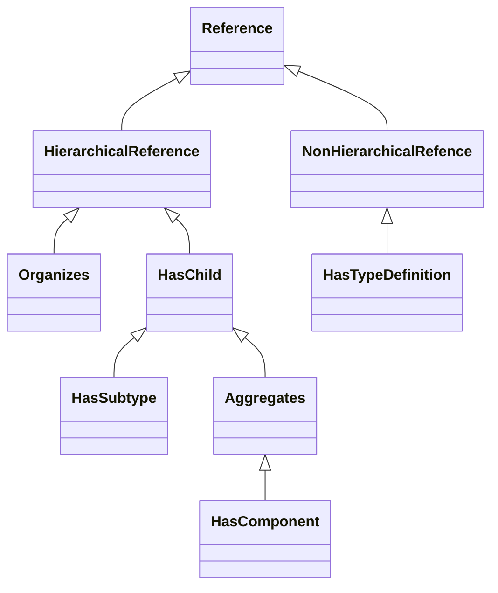

## References

- Nodes may reference other nodes via References
- References are represented as nodes, but are distinct object types and can not have a fixed set of attributes
- References can be symmetric (i.e. `is-sibling-of`) or non-symmetric (i.e. `is-child-of`, `is-parent-of`)
- References **should** be bidirectional
	- when `NodeA` references `NodeB`, there should be an equivalent reference from `NodeB` to `NodeA`
	- in practice References can be unidirectional, even when a symmetric relationship is represented
- References may reference a Node that does not exist
- References are not ordered, so querying a node for reference may return the references in different order
	- Use `HasOrderedComponent` for reference ordering
- References may be circular
	- loops while traversing references need to be handled by the client application
- The OPC UA standard specifies a set of standard reference types
- The `BrowseName` of reference types must be unique
- References form a strict hierarchy
	- Within a given hierarchy, loops are not possible
	- A OPC UA server may expose multiple hierarchies
	- Loops are possible, when a node is referenced in multiple reference hierarchies
- Using a subtype of a reference type implies that the supertype also applies
- A node that is referencing another node may only have a single reference to another node of a given type
	- This rule also applies to reference supertypes/subtypes

### References Attributes

| Attribute     | DataType      | Required | Description                                                                                                                                                                    |
| ------------- | ------------- | -------- | ------------------------------------------------------------------------------------------------------------------------------------------------------------------------------ |
| Nodeld        | Nodeld        | Required | *Inherited Node Attribute*                                                                                                                                                     |
| NodeClass     | NodeClass     | Required | *Inherited Node Attribute*                                                                                                                                                     |
| BrowseName    | QualifiedName | Required | *Inherited Node Attribute*                                                                                                                                                     |
| DisplayName   | LocalizedText | Required | *Inherited Node Attribute*                                                                                                                                                     |
| Description   | LocalizedText | Optional | *Inherited Node Attribute*                                                                                                                                                     |
| WriteMask     | Ulnt32        | Optional | *Inherited Node Attribute*                                                                                                                                                     |
| UserWriteMask | Ulnt32        | Optional | *Inherited Node Attribute*                                                                                                                                                     |
| &mdash;       | &mdash;       | &mdash;  | &mdash;                                                                                                                                                                        |
| IsAbstract    | Boolean       | Required | Specifies if the ReferenceType can be used for References or is only used for organizational purposes in the ReferenceType hierarchy                                           |
| Symmentric    | Boolean       | Required | Indicates whether the Reference is symmetric, i.e., whether the meaning is the same in forward and inverse direction                                                           |
| InverseName   | LocalizedText | Optional | Specifies the semantic of the Reference in inverse direction. It can only be applied for non-symmetric References and must be provided if such a ReferenceType is not abstract |

## Standard Reference Types



| ReferenceType Name      | Description                                                                                                                                      |
| ----------------------- | ------------------------------------------------------------------------------------------------------------------------------------------------ |
| HasComponent            | Indicates that the target node is a component or part of the source node.                                                                        |
| HasProperty             | Specifies that the target node is a property of the source node, providing additional information or characteristics.                            |
| HasSubtype              | Denotes that the target node is a subtype of the source node, establishing a type hierarchy.                                                     |
| Organizes               | Used to group nodes without implying any ownership or containment; the source node organizes the target nodes.                                   |
| HasEventSource          | Indicates that the target node can generate events and is an event source for the source node.                                                   |
| HasNotifier             | Specifies that the target node is responsible for event notifications on behalf of the source node.                                              |
| HasOrderedComponent     | Similar to HasComponent but indicates that the components have a specific order.                                                                 |
| HasModelParent          | Used in type definitions to indicate that the target node is the parent in the model hierarchy.                                                  |
| HasEncoding             | Associates a DataType node with its encoding node, defining how data of that type is represented.                                                |
| HasDescription          | Links a node to its description, providing human-readable information about the node.                                                            |
| HasTypeDefinition       | Connects an instance node to its type definition node, specifying the type of the instance.                                                      |
| HasModellingRule        | Associates a node with its modelling rule, defining constraints for instances of the node.                                                       |
| HasAddIn                | Indicates that the target node is an add-in to the source node, extending its functionality.                                                     |
| HasDictionaryEntry      | Links a node to a dictionary entry, providing semantic meaning based on an external dictionary.                                                  |
| HasInterface            | Specifies that the source node implements the interface defined by the target node.                                                              |
| HasReferenceDescription | Relates a node to a ReferenceDescription variable, which provides additional information about a reference.                                      |
| IsExecutableOn          | Indicates that a software component (source node) can be executed on a specific execution environment (target node), such as hardware or a task. |
| IsExecutingOn           | Specifies that a software component (source node) is currently executing on a particular execution environment (target node).                    |
| Controls                | Denotes that the source node controls the target node, such as a controller managing a device.                                                   |
| Utilizes                | Indicates that the source node utilizes the target node to perform its function, representing a dependency.                                      |
| Requires                | Specifies that the source node requires the target node to operate, establishing a necessary relationship.                                       |
| IsPhysicallyConnectedTo | Represents a physical connection between two hardware components, indicating they are connected without implying a hierarchical relationship.    |
| RepresentsSameEntityAs  | Indicates that two nodes represent the same real-world entity, possibly from different perspectives or models.                                   |

## XML Example

```xml
<opc:References>
    <opc:Reference opc:ReferenceType="HasComponent">ns=1;i=3001</opc:Reference>
    <opc:Reference opc:ReferenceType="HasProperty">ns=1;i=5001</opc:Reference>
</opc:References>
```

## References

- [OPC Foundation Reference](https://reference.opcfoundation.org/Core/Part23/v105/docs/4)