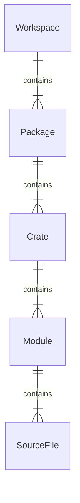

- Package contains the [[Cargo.toml]] file.
- Crate is compilation unit (`.exe` or `.dll` file)
- Module is grouping of code
```rust
pub mod modulename {
    pub mod submodulename {
        // types and functions
    }

    // types and functions
}
```

## See also

- [[Rust access modifiers]]
- [[Rust Modules]]