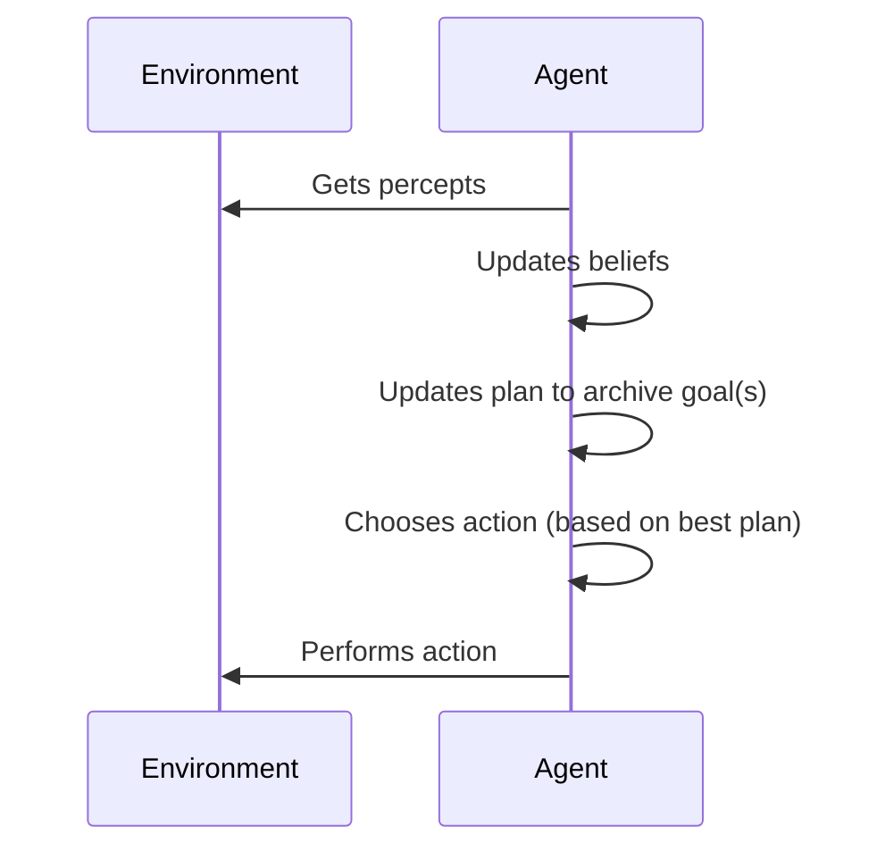

an **Intelligent Agent** is a software that
- **Situated** exists in a given environment that it interacts with
	- Has internal **beliefs** about that environment
- **Autonomous** can take independent actions without external control
- **Reactive** reacts (timely) to changes in the environment
- **Proactive** persistently persues its goals
- **Flexible** has multiple ways of archiving its goals
- **Robust** recovers from failure
- **Social** interacts with other agents

An agent optionally might
- learn from experience 
	- might be problematic in some use cases
- model emotions
- be mobile/embodied

## Advantages of Agent Systems

- well suited for distributed systems
	- provide an abstraction over (nearly) composable systems
- individual agents can be implemented by independent authors
- can work in dynamic, unpredictable, and unreliable environments 
	- when implemented correctly
	- require failure handling

## Actions and Perceptions

An agent should be both proactive and reactive

- **percept** information the agent gets from a sensor
- **event** a perceived change in the environment
	- something the agent should react to by updating its beliefs or taking an action
- **plan**
	- function that indicates whether 
		- the plan is worth trying
		- the plan can be executed given the current state
	- body of actions to execute; attempting to archive a given (sub) goal
- **action** something the agent does
- **goal** / **task** / **aim** / **desire** something the agent is working towards

## Social Agents

Agents exchange messages using pre-defined endpoints.

- **protocol** determines the security, reliability, and context flow
- **transport** the underlying transport protocol (ie. TCP or HTTP)
- **encoding** / **format** (ie. XML, JSON, binary, etc.)
- **message** definition of the message types that are exchanged

A sequence of messages form an **interaction** or **conversation**.

## Execution cycles

- Events are processed to update beliefs
	- execute immediate/reflexive actions when required
- Update goals
- Select a plan to archive the goals
	- Determine the relevant plans for a current (sub) goal
	- Determine which plans are applicable
	- Select the (currently/probable) best plan
- Execute actions of the plan
	- the plan might yield additional events, sub-goals, belief-changes, or actions

- Plans can be combined hierarchically
- The choice of plans considers the current state of the environment
- Having a number of plans to archive a goal makes the agent **flexible**
- If a plan fails, the agent tries another plan to be **robust**

## References

- [Belief Desire Intention Model](https://en.wikipedia.org/wiki/Belief%E2%80%93desire%E2%80%93intention_software_model)
- [Open Agent Architecture](https://en.wikipedia.org/wiki/Open_Agent_Architecture)

## See also

- [[Design of Agent Systems]]
- [[Semantic Kernels]]