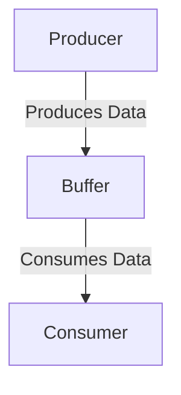

In this pattern, the Producer creates or produces data and puts it into a Buffer. The Consumer then takes or consumes this data from the Buffer. 

This pattern is commonly used in scenarios where the Producer and the Consumer operate at different speeds or in different threads or processes.

## See also

- [[BufferBlock]]