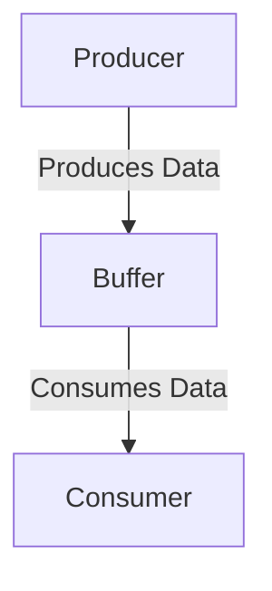

In this pattern, the Producer creates or produces data and puts it into a Buffer. The Consumer then takes or consumes this data from the Buffer. 

This pattern is commonly used in scenarios where the Producer and the Consumer operate at different speeds or in different threads or processes.



## Example

The BufferBlock from the TPL acts as a thread-safe message buffer that you can post data to from one thread, and receive data from in another thread.

```csharp
using System;
using System.Threading;
using System.Threading.Tasks;
using System.Threading.Tasks.Dataflow;

class Program
{
    static void Main(string[] args)
    {
        // Create a BufferBlock<int>.
        BufferBlock<int> buffer = new BufferBlock<int>();

        // Launch a producer task.
        Task.Run(() =>
        {
            for (int i = 0; i < 10; i++)
            {
                buffer.Post(i);
                Console.WriteLine($"Produced: {i}");
                Thread.Sleep(500); // Simulate delay.
            }

            // Mark the buffer as complete, so the consumer knows no more items will be posted.
            buffer.Complete();
        });

        // Launch a consumer task.
        Task.Run(async () =>
        {
            // Read from the buffer until it's marked as complete and all items have been read.
            while (await buffer.OutputAvailableAsync())
            {
                int item = await buffer.ReceiveAsync();
                Console.WriteLine($"Consumed: {item}");
            }
        });

        // Wait for the user to press a key before exiting, just to keep the console open.
        Console.ReadKey();
    }
}
```
