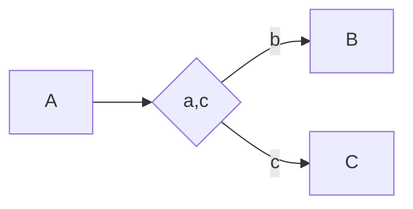

## Multi-Choice

Execute task B or C after task A. Dependent on choice can execute none, one, or both tasks.

## Structured Synchronizing Merge

Merges multiple branches, but only the braches that have been executed.

## Multi-Merge

Merges two or more branches.

## Structured Discriminator

Merges multiple branches A and B into C. 

C is executed when either A or B has executed.

## Blocking Discriminator

Merges multiple branches A and B into C. 

Cannot execute B when A is active; cannot execute A when B is active.

## Cancelling Discriminator

Merges multiple branches A and B into C. 

Cancelles B when A has completed first. Cancelles A when B has completed first.

## Structured Partial Join

Joins m tasks when n tasks have finished, where n <= m.

## Blocking Partial Join

Joins m tasks when n tasks have finished, where n <= m.

Blocks other tasks from executing.

## Cancelling Partial Join

Joins m tasks when n tasks have finished, where n <= m.

Cancelles other tasks.

## Generalised AND-Join

Merges m tasks.

## Local Synchronizing Merge

## General Synchronizing Merge

## Thread Merge

Merges the results of multiple threads where each thread processed a subset of the data.

## Thread Split

Splits the data along multiple threads.

