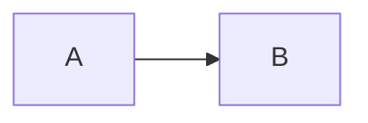
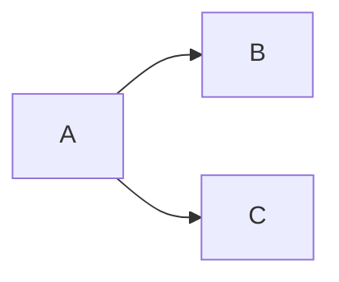
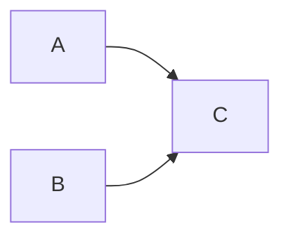
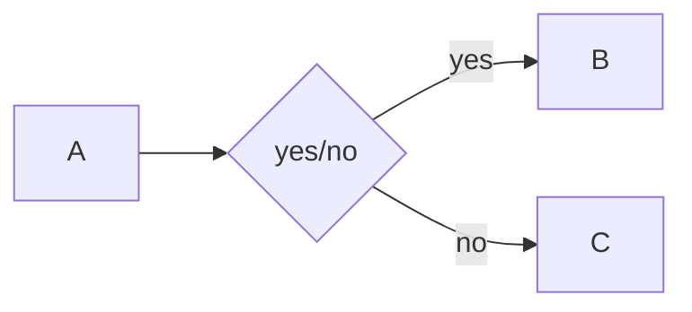
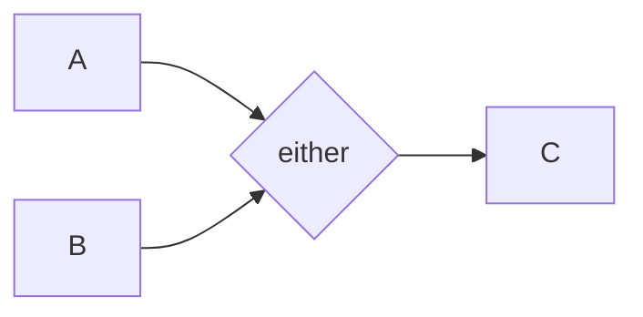

## Sequence

Execute A then B.

## Parallel Split

Execute B and C after executing A.

## Synchronization

Execute C when A and B have returned a value.

## Exclusive Choice

Execute either B or C.

## Simple Merge

Execute C when either A or B returns a value.

