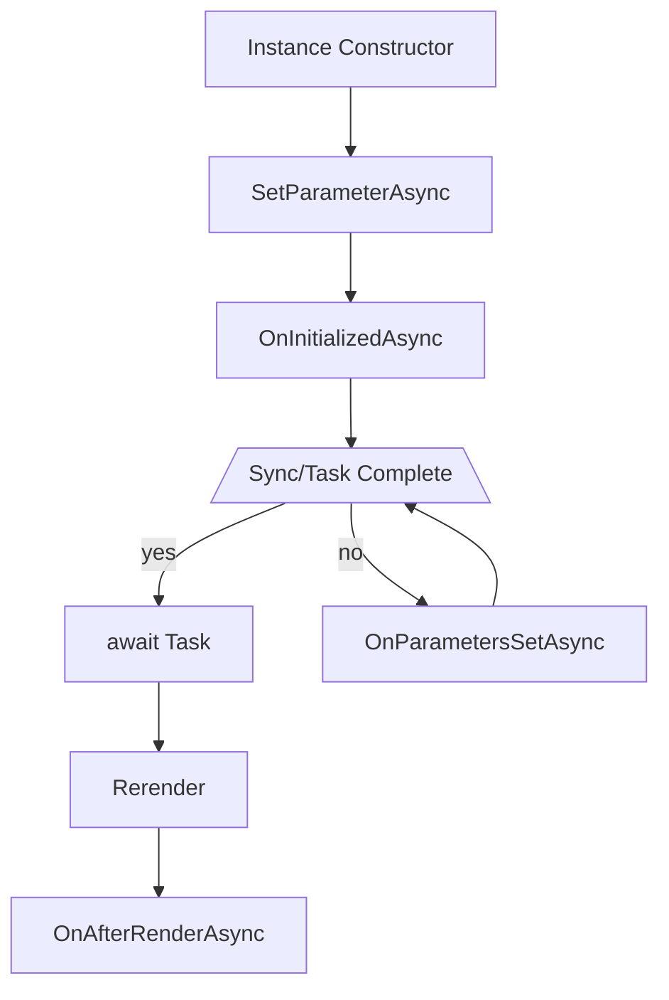

# Blazor Cheat Sheet

## Create project

```powershell
dotnet new --list
dotnet new blazorwasm --output D:\MySolution --name MyBlazorProject
dotnet new razorlib --output D:\MySolution --name MyBlazorComponent
```
```html
<Project Sdk="Microsoft.NET.Sdk.Razor">
    <PropertyGroup>
        <TargetFramework>net6.0</TargetFramework>
        <Nullable>enable</Nullable>
    </PropertyGroup>
    ...
</Project>
```

## Startup

### Server-side Blazor

```csharp
if (app.Environment.IsDevelopment()) {
    app.UseDeveloperExceptionPage();
    app.UseWebAssemblyDebugging();
}
else
{
    app.UseExceptionHandler("/Error");
    app.UseHsts();
}
app.UseHttpsRedirection();
app.UseBlazorFrameworkFiles();
app.UseStaticFiles();
app.UseRouting();
app.MapRazorPages();
app.MapControllers();
app.MapFallbackToFile("index.html");
```

## Head declarations

```csharp
@using Namespace // import namespace
@using static Namespace.StaticClassName // import static methods
@using Alias = Namespace.ClassName // import class with alias
@inherits BaseClass // inherit from base class
@implements IDisposable // implement interface
@typeparam TItem where TItem : class // implement generic type parameter
@layout MainLayout // derive layout from shared *.razor file
@page "/route/{customerId:string?}" // declare route of the page
```

## Dependency injection

In Header:
```csharp
@inject IHttpClient Client
```

Alternative version:
```csharp
@code{
    [Inject]
    private HttpClient Client { get; set; } = null!;
}
```

In Constructor of base class:
```csharp
public abstract MyComponentBase
{
    public MyComponentBase(HttpClient client)
    {
        Client = client;
    }

    protected HttpClient Client { get; set; } = null!;
}
```

Register service on startup:
```csharp
public static async Task Main(string[] args)
{
    var builder = WebAssemblyHostBuilder.CreateDefault(args);
    builder.RootComponents.Add<App>("#app");
    builder.Services.AddScoped(sp => new HttpClient { BaseAddress = new Uri(builder.HostEnvironment.BaseAddress) });
    builder.Services.AddHttpClient<MyComponent>(c => c.BaseAddress = new System.Uri("https://example.url"));
    builder.Services.AddSingleton<IMySingletonService, MySingletonService>();
    builder.Services.AddTransient<IMyTransientService, MyTransientService>();
    await builder.Build().RunAsync();
}
```

### Global imports

Global namespace imports are defined either in `_Imports.razor` or in the `.csproj` file.
```xml
<Project Sdk="Microsoft.NET.Sdk.Razor">
    <PropertyGroup>
        ...
        <ImplicitUsings>enable</ImplicitUsings>
    </PropertyGroup>
    <ItemGroup>
        <Using Include="Namespace" />
    </ItemGroup>
    ...
</Project>
```

## Data Binding

### One-Way Binding

```html
<p>Count: @count</p>
<button class="btn btn-primary"
    disabled="@(currentCount > 10)"
    @onclick="IncrementCount">
    ...
</button>
```
```csharp
@code {
    private int currentCount = 0;
    private void IncrementCount(MouseEventArgs args)
    {
        // ...
    }
}
```

### Two Way Binding

```html
<input type="number"
    @bind="@currentCount"
    @onchange="OnChange" />
```
```csharp
@code {
    private int currentCount = 0;
    private void OnChange(ChangeEventArgs args)
    {
        // ...
    }
}
```

### Lambda Functions

```html
<button @onclick="@(() => currentCount++)">...</button>
```

### Prevent default action or event propagation

```html
<input type="number" 
    @bind="@increment"
    @onkeypress="OnKeyPressed"
    @onkeypress:preventDefault
    @onmousemove:stopPropagation
/>
```

### Data formatting

```html
<input @bind="@Today" @bind:format="yyyy-MM-dd" />
```
```html
<div>@($"{item.Price:0.00}")</div>
```

## Validation

```csharp
public sealed class CustomerInfo
{
    [StringLength(40, ErrorMessage = "Name is too long.")]
    [Required(ErrorMessage = "Please provide a name")]
    public string Name { get; set; } = string.Empty;
}

public sealed class State
{
    public CustomerInfo CustomerInfo { get; set; } = new();
}
```

```html
<EditForm Model="@State.CustomerInfo" OnValidSubmit="PlaceOrder">
    <DataAnnotationsValidator />
    <ValidationMessage For="@(() => State.CustomerInfo.Name)" />
    <InputText @bind-Value="@Name" />
    <button @onclick="OnSubmit">Submit</button>
</EditForm>
```
```csharp
@code{
    public MyState State { get; set; } = new();

    public void OnSubmit()
    {
        // ...
    }
}
```

**See also**
* [ASP.NET Core Blazor forms and input components](https://docs.microsoft.com/en-us/aspnet/core/blazor/forms-and-input-components)

## Components
```csharp
// MyComponent.razor
@code
{
    private string _name = string.Empty;

    [Parameter]
    public string Name
    {
        get => _name;
        set
        {
            if(_name == value) return;
            _name = value;
            _ => NameChanged.InvokeAsync(value);
            StateHasChanged();
        }
    }

    [Parameter]
    public EventCallback<string> NameChanged { get; set; } = default!;
}
```

Usage:
```html
<MyComponent Name="value" @NameChanged="OnNameChanged" />
```

### Cascading parameters

Either use `INotifyPropertyChanged`/`INotifyPropertyChanging` or use `[CascadingParameter(Name="name")]` attribute.

### Component Lifecycle



Overrides:
```csharp
protected override async Task OnInitializedAsync() {/*...*/}
protected override async Task SetParameterAsync() {/*...*/}
protected override async Task OnParametersSetAsync() {/*...*/}
protected override async Task OnAfterRenderAsync() {/*...*/}
```

## Error Boundary

Prevents the bubbling of exceptions to parent elements
```html
<ErrorBoundary>...</ErrorBoundary>
```

## Virtualization of large item lists

```html
@using MyNamespace.Customers
@using System.Diagnostics
@inject ICustomersService CustomersService

<table class="table">
    <thead><tr><th>First Name</th><th>Last Name</th></tr></thead>
    <tbody>
        <Virtualize ItemsProvider="@LoadCustomers" ItemSize="25" Context="customer">
            <ItemContent><tr><td>@customer.FirstName</td><td>@customer.LastName</td></tr></ItemContent>
            <Placeholder><tr><td colspan="2">Loading...</td></tr></Placeholder>
        </Virtualize>
    </tbody>
</table>
```
```csharp
@code {
    private async ValueTask<ItemsProviderResult<Customer>> LoadCustomers(ItemsProviderRequest request)
    {
        var (customers, totalItemCount) = await CustomersService.GetCustomers(request.StartIndex, request.Count, request.CancellationToken);
        return new ItemsProviderResult<Customer>(customers, totalItemCount);
    }

    // alternative version
    private async ValueTask<(List<Customer>, int)> LoadCustomers(int startIndex, int count, CancellationToken cancellationToken)
    {
        var (customers, totalItemCount) = await CustomersService.GetCustomers(startIndex, count, cancellationToken);
        return new ItemsProviderResult<Customer>(customers, totalItemCount);
    }
}
```

## Unit Testing

Use [bUnit](https://bunit.dev/) for unit testing blazor components.
```csharp
[Test]
public void SomeTest()
{
    using var context = new TestContext();
    var component = context.RenderComponent<MyComponent>(params =>
    {
        var propValue = 5;
        params.Add(c => c.Property, propValue);
    });
    component.Find("button").Click();
    component.Find("p").MarkupMatches(@"<p>Current count: 1</p>");
}
```

## Layout Components

**MyProject.csproj**
```html
<ItemGroup>
    <BlazorWebAssemblyLazyLoad Include="Lazy.Loading.Component.dll" />
</ItemGroup>
```

**App.razor**
```html
<Router
    AppAssembly="@typeof(Program).Assembly"
    AdditionalAssemblies="@additionalAssemblies"
    OnNavigateAsync="OnNavigate">
    <Found Context="routeData">
        <RouteView RouteData="@routeData" DefaultLayout="@typeof(MainLayout)" />
    </Found>
    <NotFound>
        <LayoutView Layout="@typeof(MainLayout)">
            <p>Not found message...</p>
        </LayoutView>
    </NotFound>
</Router>
```
```csharp
@code
{
    private List<Assembly> additionalAssemblies = new
    {
        typeof(MyComponent).Assembly
    };

    private async Task OnNavigate(NavigationContext context)
    {
        if(context.Path == "requires/lazy/component")
        {
            var assembliesToLoad = new List<string>
            {
                "Lazy.Loading.Component.dll"
            };
            var assemblies = await assemblyLoader
                .LoadAssembliesAsync(assembliesToLoad);
            additionalAssemblies.AddRange(assemblies);
        }
    }
}
```

**MainLayout.razor**
```csharp
@inherits LayoutComponentBase
```
```html
<div class="page">
    <div class="sidebar">
        <NavMenu />
    </div>
    <div class="main">
        @Body
    </div>
</div>
```

## State Management
* [Fluxor](https://github.com/mrpmorris/Fluxor) Flux/Redux library for .NET
* [ReactiveUI for Blazor](https://www.reactiveui.net/docs/guidelines/platform/blazor)
* [Blazorized LocalStorage](https://github.com/Blazored/LocalStorage)

## Real-Time messaging
* [SignalR](https://docs.microsoft.com/en-us/aspnet/signalr/)

## Libraries
* [Awesome Blazor](https://github.com/AdrienTorris/awesome-blazor)