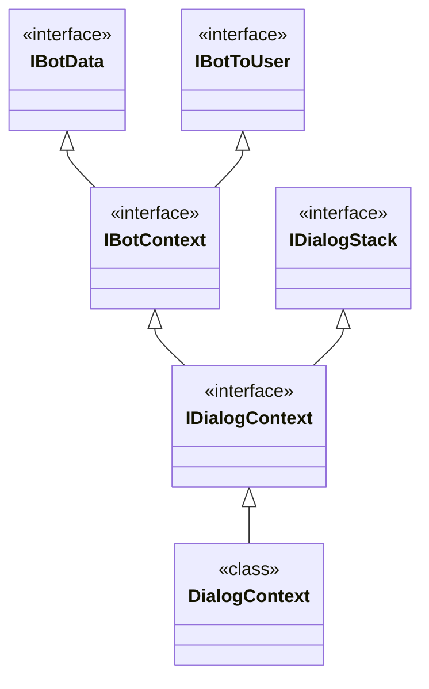

Represent a set of possible interactions.
Dialogs can be composed of subdialogs and forms.

```csharp
[Serializable]
public class NameDialog : IDialog<string>
{
    public async Task StartAsync(IDialogContext context)
    {
        await context.PostAsync("What is your name?"); 
        context.Wait(MessageReceivedAsync);
    }
    
    private async Task MessageReceivedAsync
    (
        IDialogContext context,
        IAwaitable<IMessageActivity> result
    )
    {
	    var message = await result;
	    if ((message.Text != null) && (message.Text.Trim().Length > 0))
	    {
		    context.Done(message.Text);
		}
	}
}
```

```csharp
public enum title { Mr, Mrs, others }

[Serializable]
public class ParentDialog : IDialog<object>
{
	private title _salvation;
	private string _name;

	public async Task StartAsync(IDialogContext context)
	{
		await context.PostAsync("Hi There!! Lets get started !!");
		context.Wait(GetStarted);
	}

	public virtual async Task GetStarted(IDialogContext context, IAwaitable<object> result)
	{
		var input = await result;
		PromptDialog.Choice(
		    context: context,
		    resume: NameFromUserMethod,
		    options: Enum.GetValues(typeof(title)).Cast<title>().ToArray(),
		    prompt: "How would you like to be addressed ? (Mr, Mrs or others):",
		    retry: "I was clueless about this input! Please try again!!");
	}

	public virtual async Task NameFromUserMethod(IDialogContext context, IAwaitable<title> result)
	{
		_salvation = await result;
		PromptDialog.Text(
			context: context,
			resume: CityFromUserMethod,
			prompt: "Please provide your full name:",
			retry: "I was clueless about this input! Please try again!!");
	}
	
	public virtual async Task CityFromUserMethod(IDialogContext context, IAwaitable<string> result)
	{
		string _name = await result;
		PromptDialog.Confirm(
			context: context,
			resume: GetCityFromUserMethod,
			prompt: $"You entered {_salvation} {_name} !! Click yes to confirm!!",
			retry: "I was clueless about this input! Please try again!!");
	}

	public virtual async Task GetCityFromUserMethod(IDialogContext context, IAwaitable<bool> result)
	{
		bool register = await result;
		if (register)
		{
			await context.PostAsync("Thanks for providing your details about your name!");
			await context.PostAsync("you may close this conversation.");
		}
		else
		{
			await context.PostAsync("please submit any key to get started.");
			context.Wait(GetStarted);
		}
	}
}
```

## Important Interfaces

| Interface      | Description                                                    |
| -------------- | -------------------------------------------------------------- |
| `IBotData`     | access user data, conversation data, private conversation data |
| `IBotToUser`   | create and send data to users                                  |
| `IDialogStack` | manage the stack of dialogs and dialog progress                |
| `IBotContext`  | retrive bot data                                               |


