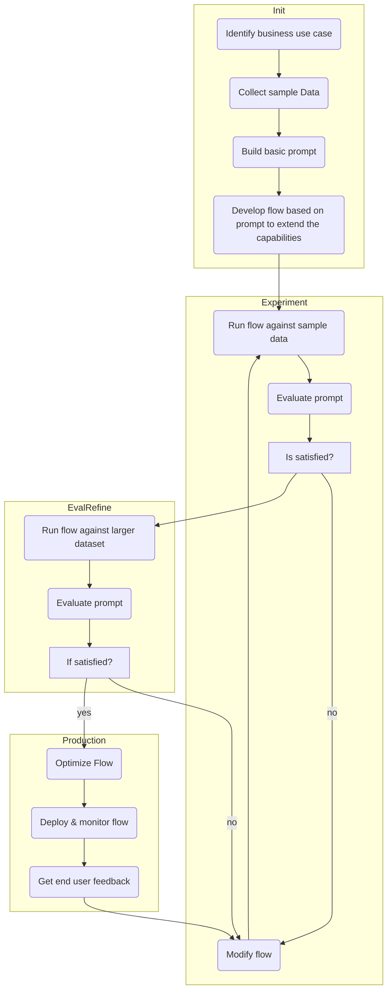

## Basic Workflow

```mermaid
flowchart TD
  Init("Initialization")
  Experiment("Experiment")
  EvalRefine("Evaluate & Refine")
  Production("Production")

  subgraph Init
    UseCase("Identify business use case")
    SampleData("Collect sample Data")
    BasicPrompt("Build basic prompt")
    DevelopFlow("Develop flow based on prompt to extend the capabilities")

    UseCase --> SampleData
    SampleData --> BasicPrompt
    BasicPrompt --> DevelopFlow
  end

  subgraph Experiment
    RunSample("Run flow against sample data")
    EvalPrompt1("Evaluate prompt")
    Satisfied1["Is satisfied?"]
    Modify("Modify flow")

    RunSample --> EvalPrompt1
    EvalPrompt1 --> Satisfied1
    Satisfied1 -- no --> Modify
    Modify --> RunSample
  end

  subgraph EvalRefine
    RunLarge("Run flow against larger dataset")
    EvalPrompt2("Evaluate prompt")
    Satisfied2["If satisfied?"]

    RunLarge --> EvalPrompt2
    EvalPrompt2 --> Satisfied2
    Satisfied2 -- no --> Modify
  end

  subgraph Production
    Optimize("Optimize Flow")
    Deploy("Deploy & monitor flow")
    Feedback("Get end user feedback")

    Optimize --> Deploy
    Deploy --> Feedback
  end

  DevelopFlow --> RunSample
  Satisfied1 --> RunLarge
  Satisfied2 -- yes --> Optimize
  Feedback --> Modify
```
