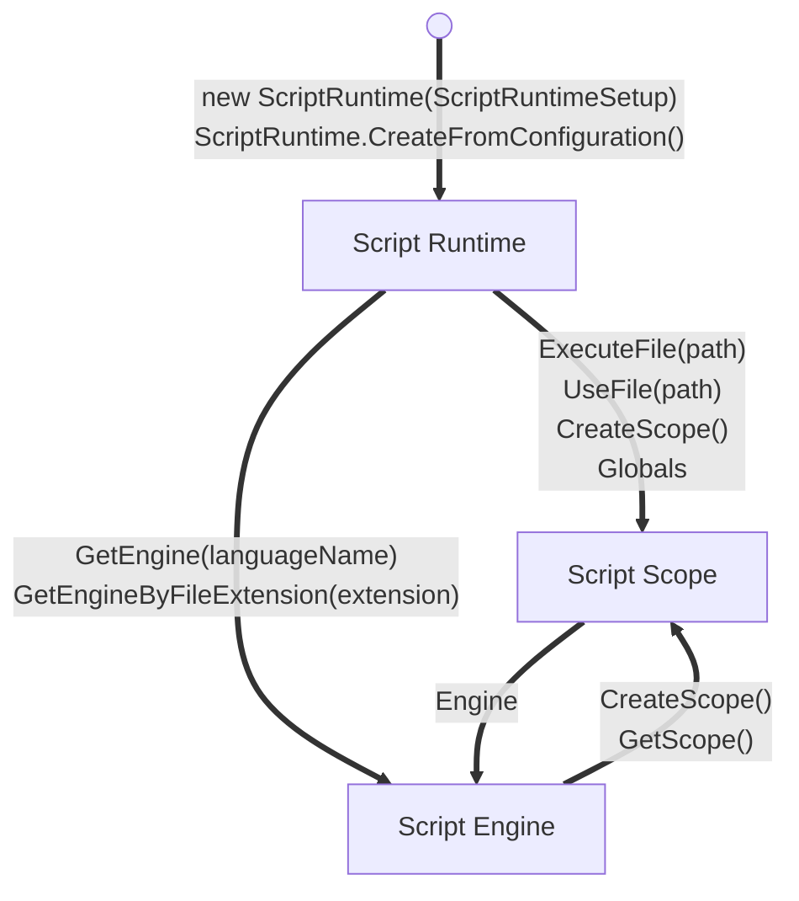

Located in the [Microsoft.Scripting Namespace](https://github.com/IronLanguages/dlr/tree/main/Src/Microsoft.Scripting)

## Scripts



## Configuration

### Adding scripting language in `app.config`

```xml
<?xml version="1.0"?>
<configuration>
  <configSections>
    <section
	    name="microsoft.scripting"
	    type="Microsoft.Scripting.Hosting.Configuration.Section, Microsoft.Scripting"/>
  </configSections>
  <microsoft.scripting>
    <languages>
      <language
	      names="IronPython;Python;py"
          extensions=".py"
          displayName="IronPython"
          type="IronPython.Runtime.PythonContext, IronPython"/>
    </languages>
  </microsoft.scripting>
```

```csharp
ScriptRuntime runtime = ScriptRuntime.CreateFromConfiguration();
```

### Adding scripting language in code

Create `ScriptRuntimeSetup`
```csharp
var runtimeSetup = new ScriptRuntimeSetup();
```

Adding IronPython
```csharp
var language = new LanguageSetup(
	"IronPython.Runtime.PythonContext, IronPython",
	"IronPython",
	new ["IronPython", "Python", "py"],
	new ["py"]);

runtimeSetup.LanguageSetups.Add(language);
```

Adding IronRuby
```csharp
var language = new LanguageSetup(
    typeName: "IronRuby.Runtime.RubyContext, IronRuby",
    displayName: "IronRuby",
    names: new[] { "IronRuby", "Ruby", "rb" },
    fileExtensions: new[] { ".rb" });

runtimeSetup.LanguageSetups.Add(language);
```

Initialize runtime
```csharp
var runtime = new ScriptRuntime(runtimeSetup);
```

### Adding scripting language from `.config` file

Read config from a file path
```csharp
// read from file path
var runtimeSetup = ScriptRuntimeSetup.ReadConfiguration("custom.config");
```
 
 Read config from `Sytem.Stream` object
```csharp
var runtimeSetup = ScriptRuntimeSetup.ReadConfiguration(fileStream);
```

Initialize runtime
```csharp
var runtime = new ScriptRuntime(runtimeSetup);
```

## Use Scripting engine

Execute source code
```csharp
ScriptEngine engine = runtime.GetEngine("IronPython");
engine.Execute("print 'Hello World!'");
```

Execute source code with result
```csharp
ScriptEngine engine = runtime.GetEngine("IronPython");
string name = engine.Execute<string>("input('what is your name')");
int age = engine.Execute<int>("input('what is your age')");
```

Add global variables
```csharp
runtime.Globals.SetVariable("Foo", "foo");
runtime.Globals.SetVariable("Bar", 7);
```

Add scoped variables
```csharp
var scope = runtime.CreateScope();
scope.SetVariable(/*...*/);
scope.SetVariable(/*...*/);
```

Add custom source code
```csharp
ScriptSource source = engine.CreateScriptSourceFromString("SOME_SOURCE_CODE");
CompiledCode code = source.Compile();

var result = code.Execute<TResult>(scope)
```

### Script Scope

| Method                                                | Description                                                                                                       |
| ----------------------------------------------------- | ----------------------------------------------------------------------------------------------------------------- |
| `bool ContainsVariable(string name)`                  | Test to see if a named variable exists                                                                            |
| `T GetVariable<T>(string name)`                       | Fetch the specified variable's value as a specific type, throwing an exception when not found                     |
| `dynamic GetVariable(string name)`                    | Fetch the specified variable's value as a dynamic object, throwing an exception when not found                    |
| `IEnumerable<string> GetVariableNames()`              | Iterate over the names of all of the variables in the scope                                                       |
| `bool RemoveVariable(string name)`                    | Eliminate the specified variable within the scope                                                                 |
| `bool TryGetVariable<T>(string name, out T value)`    | Attempt to fetch the specified variable's value as a specific type, returning true when found or false otherwise  |
| `bool TryGetVariable(string name, out dynamic value)` | Attempt to fetch the specified variable's value as a dynamic object, returning true when found or false otherwise |

## Important Notes

- Script engines should run in an dedicated `AppDomain` boundary to isolate the application from the scripts
- in Legacy .NET application RPC calls have been done via `MarshalByRefObject` and Serialization
- use other RPC methods like [[Protobuf - Protocol Buffers]] for modern applications
