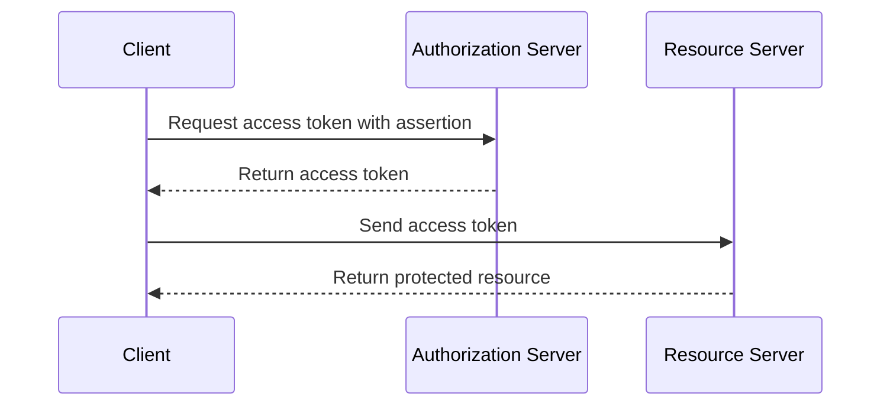

## Assertion Flow

1.  The client sends an assertion to the authorization server to request an access token.
2.  The authorization server authenticates the client and verifies the assertion, and returns an access token to the client.

