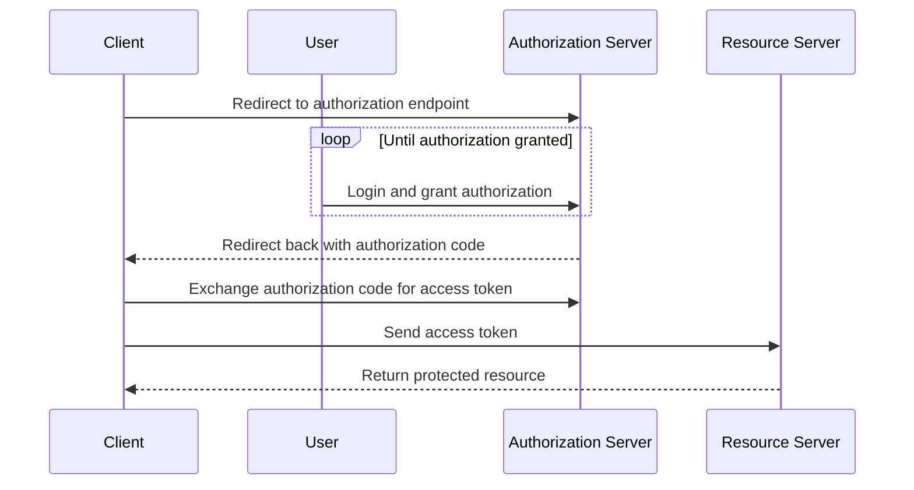

## Authorization Code Flow
1.  The client redirects the user to the authorization server to obtain authorization.
2.  The user logs in and grants authorization to the client.
3.  The authorization server redirects the user back to the client with an authorization code.
4.  The client exchanges the authorization code for an access token.

