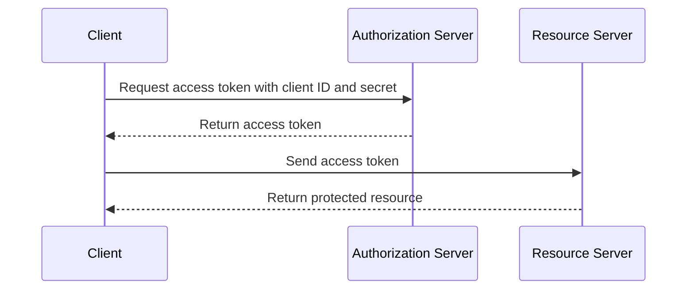

## Client Credentials Flow

1.  The client sends its own credentials (client ID and secret) to the authorization server.
2.  The authorization server authenticates the client and returns an access token to the client.

