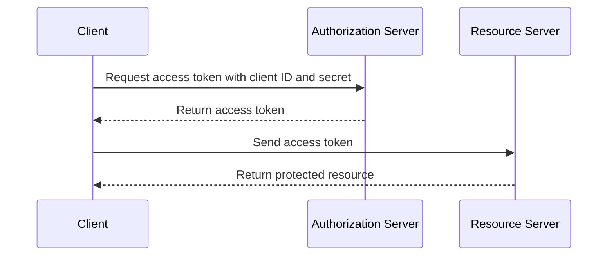

## Device Code Flow

1.  The client sends a request to the authorization server to initiate the device code flow.
2.  The authorization server sends a device code and a user code to the client.
3.  The client displays the user code to the user and instructs them to go to a URL to grant authorization.
4.  The user goes to the URL, enters the user code, and grants authorization to the client.
5.  The authorization server sends an access token to the client.

