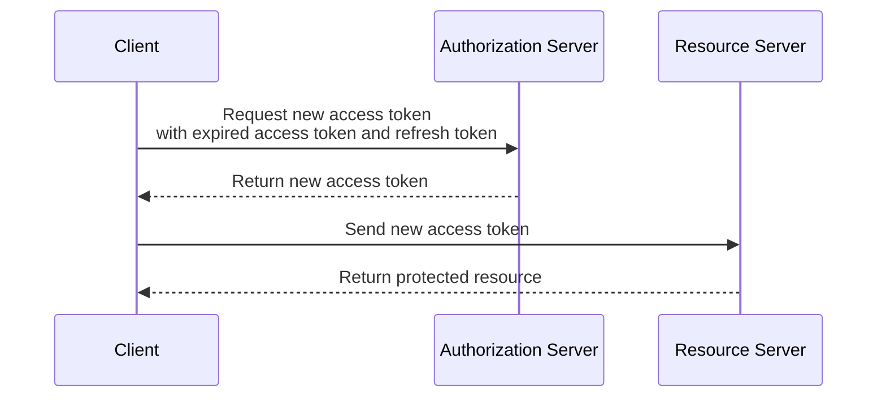

## Refresh Token Flow

1.  The client sends the expired access token and a refresh token to the authorization server.
2.  The authorization server verifies the refresh token and returns a new access token to the client.

**Note** the refresh token flow is not a standalone flow, but rather it is used in conjunction with one of the other flows. The refresh token is issued along with the access token and can be used to obtain a new access token once the original access token has expired.
