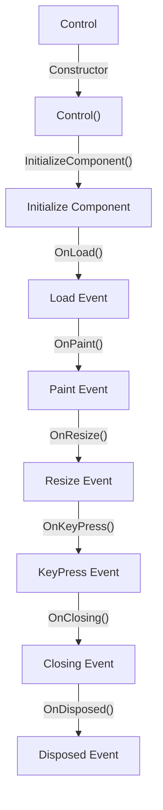

The lifecycle of a WinForms control typically follows these steps:

1.  The control is instantiated through its constructor (`Control()`).
2.  The `InitializeComponent()` method is called to initialize the control.
3.  The `OnLoad()` method is called, triggering the Load event.
4.  The `OnPaint()` method is called, triggering the Paint event.
5.  The `OnResize()` method is called, triggering the Resize event.
6.  The `OnKeyPress()` method is called, triggering the KeyPress event.
7.  The `OnClosing()` method is called, triggering the Closing event.
8.  Finally, the `OnDisposed()` method is called, triggering the Disposed event.

